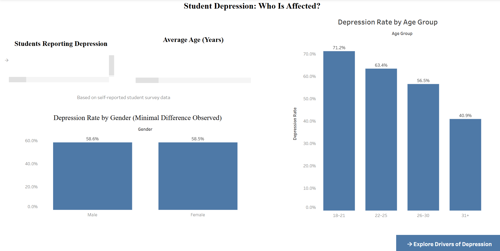
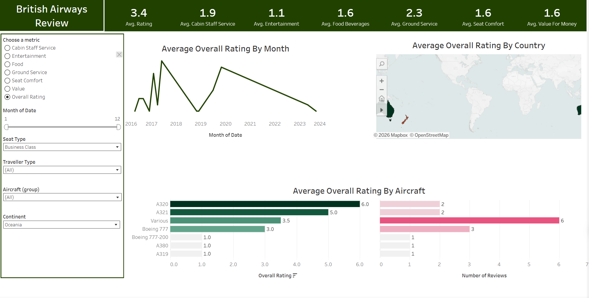

# Projects

<!-- PROJECTS_START -->

  
  <h3>Healthcare Performance and Cost Analysis</h3>
  
Tableau Data Visualization Healthcare Analytics Data Analysis

  
Interactive Tableau dashboard analyzing healthcare costs, patient conditions, billing, and length of stay.

  
<a href="https://github.com/Ilie1985/healthcare-tableau-dashboard" target="_blank" rel="noopener">Project Information</a> | <a href="https://public.tableau.com/app/profile/marian.stefanita.ilie/viz/HealthcarePerformanceandCostAnalysisAnInteractiveTableauDashboard/Dashboard0ExecutiveSummary" target="_blank" rel="noopener">Tableau</a>

  
  <h3>Student Depression Analysis</h3>
  
Tableau Data Visualization Mental Health Analytics Data Analysis

  
Interactive Tableau dashboard analysing student depression patterns, related factors, and key trends in the dataset.

  
<a href="https://github.com/Ilie1985/Student-Depression-Trends-Drivers-Analysis-Tableau-Dashboard-" target="_blank" rel="noopener">Project Information</a> | <a href="https://public.tableau.com/app/profile/marian.stefanita.ilie/viz/Studentdepression_17701550528510/Page1DepressionTrendsDemographics" target="_blank" rel="noopener">Tableau</a>

  
  <h3>British Airways Reviews Analysis</h3>
  
Tableau Data Visualization Customer Reviews Data Analysis

  
Interactive Tableau dashboard analysing British Airways customer reviews, satisfaction patterns, and key service trends.

  
<a href="https://github.com/Ilie1985/British-Airways-Sentiment-and-Reviews-Analysis" target="_blank" rel="noopener">Project Information</a> | <a href="https://public.tableau.com/app/profile/marian.stefanita.ilie/viz/BAReviews_17717059451810/Dashboard1" target="_blank" rel="noopener">Tableau</a>

<!-- PROJECTS_END -->