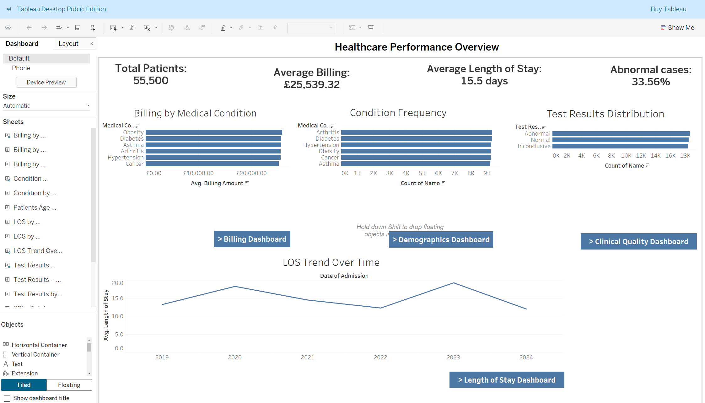
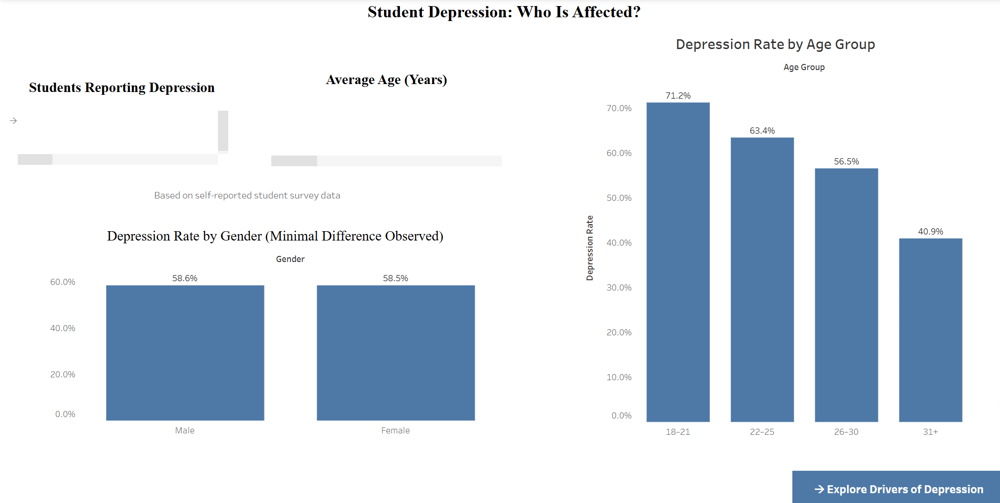
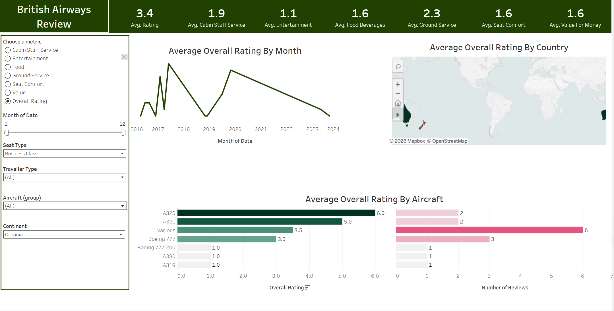
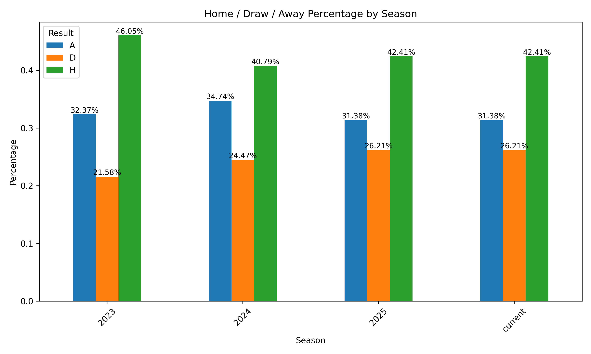
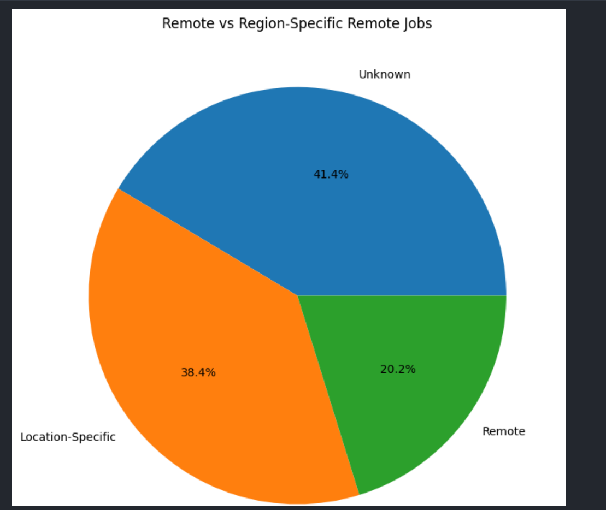
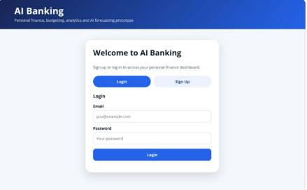
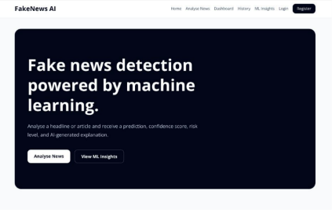

# Projects

<!-- PROJECTS_START -->

  
  <h3>Healthcare Performance and Cost Analysis</h3>
  
Tableau Data Visualization Healthcare Analytics Data Analysis

  
Interactive Tableau dashboard analyzing healthcare costs, patient conditions, billing, and length of stay.

  
<a href="https://github.com/Ilie1985/healthcare-tableau-dashboard" target="_blank" rel="noopener">Project Information</a> | <a href="https://public.tableau.com/app/profile/marian.stefanita.ilie/viz/HealthcarePerformanceandCostAnalysisAnInteractiveTableauDashboard/Dashboard0ExecutiveSummary" target="_blank" rel="noopener">Tableau</a>

  
  <h3>Student Depression Analysis</h3>
  
Tableau Data Visualization Mental Health Analytics Data Analysis

  
Interactive Tableau dashboard analysing student depression patterns, related factors, and key trends in the dataset.

  
<a href="https://github.com/Ilie1985/Student-Depression-Trends-Drivers-Analysis-Tableau-Dashboard-" target="_blank" rel="noopener">Project Information</a> | <a href="https://public.tableau.com/app/profile/marian.stefanita.ilie/viz/Studentdepression_17701550528510/Page1DepressionTrendsDemographics" target="_blank" rel="noopener">Tableau</a>

  
  <h3>British Airways Reviews Analysis</h3>
  
Tableau Data Visualization Customer Reviews Data Analysis

  
Interactive Tableau dashboard analysing British Airways customer reviews, satisfaction patterns, and key service trends.

  
<a href="https://github.com/Ilie1985/British-Airways-Sentiment-and-Reviews-Analysis" target="_blank" rel="noopener">Project Information</a> | <a href="https://public.tableau.com/app/profile/marian.stefanita.ilie/viz/BAReviews_17717059451810/Dashboard1" target="_blank" rel="noopener">Tableau</a>

  
  <h3>Premier League Multi-Season Analytics & Match Prediction</h3>
  
Python API Data Extraction Machine Learning Data Visualization

  
End-to-end football analytics project using API data, rolling feature engineering, and predictive modelling.

  
<a href="https://github.com/Ilie1985/pl-football-analytics" target="_blank" rel="noopener">Project Information</a>

  
  <h3>Job Market Intelligence Pipeline</h3>
  
Python Web Scraping Data Cleaning SQLite Data Analysis

  
End-to-end job market analytics project using web scraping, data cleaning, SQLite storage, and visual analysis of technical skills, locations, remote work patterns, and salary availability.

  
<a href="https://github.com/Ilie1985/job_market" target="_blank" rel="noopener">Project Information</a>

  
  <h3>AI Banking — Personal Finance Analytics and Forecasting App</h3>
  
Python FastAPI JavaScript Supabase PostgreSQL Machine Learning Data Analysis

  
Full-stack personal finance web app allowing users to sign up, log in, add transactions, upload CSV data, manage budgets, analyse spending patterns, and generate machine learning-based spending forecasts.

  
<a href="https://ai-banking-project.vercel.app" target="_blank" rel="noopener">Live App</a> | <a href="https://github.com/Ilie1985/AI_Banking_Project" target="_blank" rel="noopener">Project Information</a>

  
  <h3>FakeNews AI — Machine Learning Fake News Detection App</h3>
  
Python FastAPI Next.js TypeScript Supabase PostgreSQL Machine Learning Gemini API Data Analysis

  
Full-stack AI and machine-learning web app allowing users to sign up, log in, analyse news headlines or articles, receive fake or real predictions, view confidence scores and risk levels, save analysis history, explore dashboard statistics, and view machine-learning model insights with AI-generated explanations.

  
<a href="https://fake-news-identifier-omega.vercel.app" target="_blank" rel="noopener">Live App</a> | <a href="https://github.com/Ilie1985/Fake_news_identifier" target="_blank" rel="noopener">Project Information</a>

<!-- PROJECTS_END -->